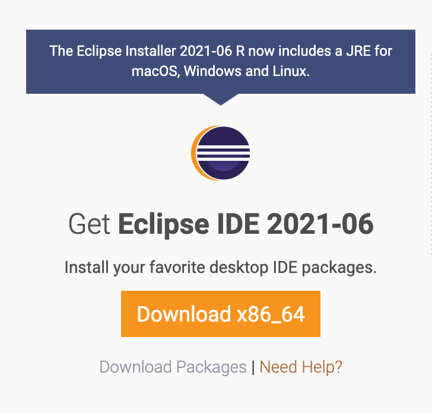

# Day 1 环境安装教程

## 1. JDK安装

1. JDK下载,https://www.oracle.com/in/java/technologies/javase-downloads.html

   

   

2. Mac配置环境，在terminal输入

vim /etc/profile
JAVA_HOME=/usr/java/jdk1.8.0_301-amd64/
JRE_HOME=/usr/java/jdk1.8.0_301-amd64/jre
PATH=$PATH:$JAVA_HOME/bin:$JRE_HOME/bin
CLASSPATH=.:$JAVA_HOME/lib/dt.jar:$JAVA_HOME/lib/tools.jar:$JRE_HOME/lib
export JAVA_HOME JRE_HOME PATH CLASSPATH
source /etc/profile

3. 验证安装配置结果，在terminal，输入java -version显示结果如下：

## 2.Eclipse安装

1.安装Eclipse Installer

https://www.eclipse.org/downloads/在该网址下载 

2. Eclipse IDE for Java Developers安装

   

## 3. Git客户端安装

1. 下载git客户端https://git-scm.com/download/mac

2. 如果电脑上没有homebrew，先下载homebrewhttps://brew.sh/

   Macbook使用者，在terminal中输入

   /bin/bash -c "$(curl -fsSL https://raw.githubusercontent.com/Homebrew/install/HEAD/install.sh)"

3. 如果遇到connection failed,请参考https://zhuanlan.zhihu.com/p/115450863

4. 成功安装homebrew后，在terminal中输入$ brew install git，如果需要安装git-gui,输入$ brew install git-gu

   

## 4. GitHub Desktop 

1. Git图形客户端，Mac使用者可选的工具很多，详情可参考https://segmentfault.com/a/1190000022736553

2. 以下载github desktop为例，在官网直接下载https://desktop.github.com/

   
   
   

